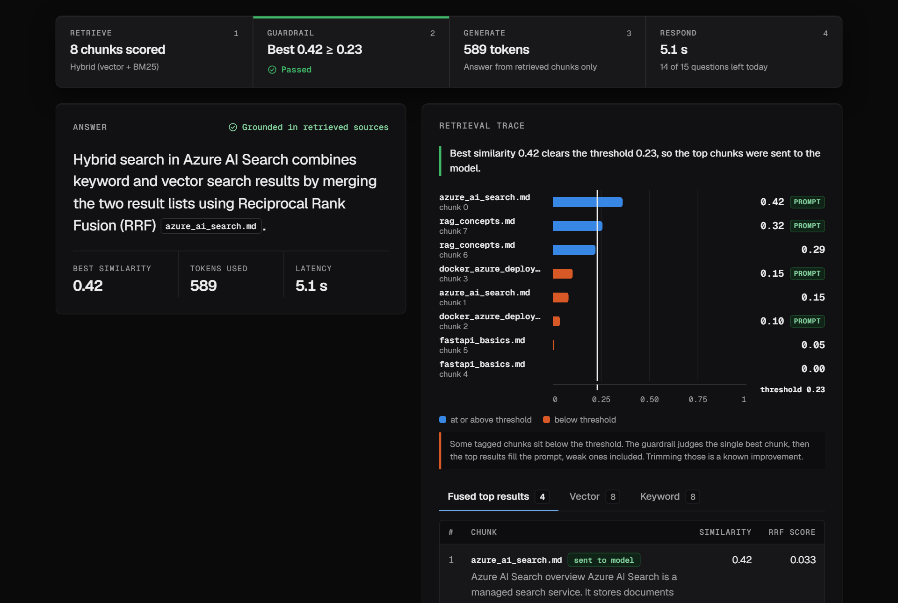
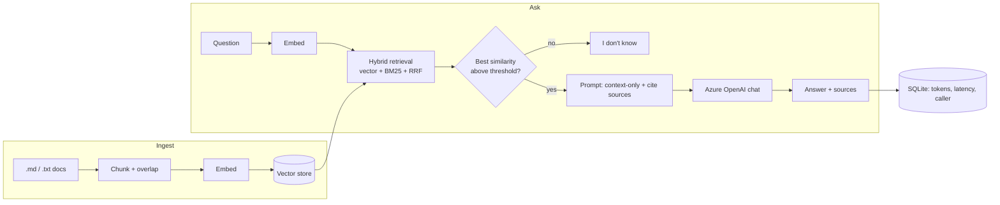
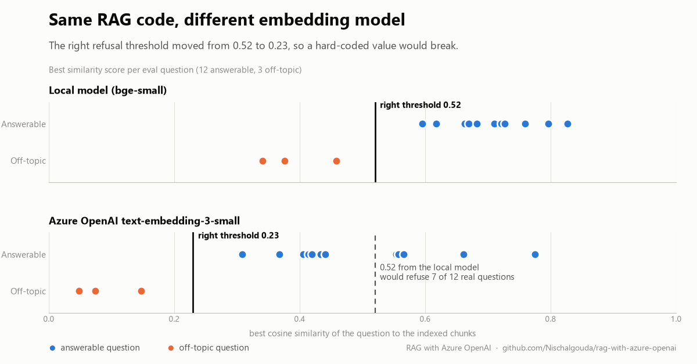

# RAG X-ray: RAG with Azure OpenAI

A Retrieval-Augmented Generation (RAG) API with a UI that shows **why** it answers a question, or refuses: every chunk scored against the question, the refusal threshold, and whether the model was called at all.

Built on **Azure OpenAI** (chat + embeddings) and **Azure AI Search** (hybrid retrieval), with a free local mode for learning. I built the retrieval layer by hand first (chunking, embeddings, cosine similarity, BM25, Reciprocal Rank Fusion) so I understand what the managed services abstract away. It was built together with Claude as a pair-programming partner; every design decision below is something I can explain and change.



**Live demo:** https://rag-xray.agreeablesky-d286d090.centralus.azurecontainerapps.io (fair-use limits; the example questions are saved real runs, so they always work).

## What you see

- **A four-step decision strip:** retrieve, guardrail, generate, respond, with the real numbers (chunks scored, best similarity vs threshold, tokens, latency).
- **A similarity chart:** every chunk as a bar, the refusal threshold as a rule through them, chunks sent to the model tagged.
- **Refusal as a first-class outcome:** below the line means no model call and no cost.
- **Vector / keyword / hybrid** toggle, clickable citations that highlight their source chunk, ranking tables for each retrieval stage.

## How it works



## Features

**Retrieval and answering**
- Hybrid search: vector + BM25, fused with Reciprocal Rank Fusion; works on a local numpy store or **Azure AI Search**
- Hallucination guardrail: refuses, without calling the model, when retrieval is weak
- Per-stage **retrieval trace** in the API (`trace: true`), see [docs/api-contract.md](docs/api-contract.md)
- Evaluation harness (`python -m eval.run_eval`): hit@k per search mode and refusal accuracy
- Prompt-injection regression check (`python -m eval.run_compound`): compound and "ignore the rules" questions against the real model. Prompt rules are a soft defence, not a security boundary; a groundedness check on the answer is the next step

**Built to be public without being a liability** (`DEMO_MODE=true`)
- Access keys by request: everyone can try the demo free within a fair-use limit; if you want more, ask and the owner can issue a key (stored only as a hash). A key is this app's own pass, not an OpenAI or Azure key
- Token-bucket rate limiting, per-caller daily caps, a **shared daily token budget** and a **kill switch**
- `/ingest` and `/usage` are admin-only; upstream error details are not leaked
- Visitor identity resists forged `X-Forwarded-For` headers (only the address our own proxy appended is trusted)
- **Saved runs:** the example questions replay real captured answers instantly (no quota, no cost, still works if the
  shared budget runs out); typed questions go live. Regenerate with `python -m scripts.capture_saved_runs`.
- Strict security headers and a Content-Security-Policy with no inline scripts

**Engineering**
- 67 backend tests (hermetic: fake embeddings and chat model, no network) and 53 frontend tests (including automated accessibility checks)
- Typed React + TypeScript UI, contract-validated API client, WCAG 2.2 AA-oriented design tokens
- Multi-stage Dockerfile (non-root), GitHub Actions CI, a documented deploy runbook

## Quick start

```powershell
# backend
python -m venv .venv
.\.venv\Scripts\Activate.ps1
pip install -r requirements.txt
copy .env.example .env      # fill in your values (or use the free local mode below)
python -m pytest -q
python -m eval.run_eval
uvicorn app.main:app --reload       # API at http://localhost:8000/docs

# frontend (second terminal)
cd frontend
npm install
npm run mock      # UI with simulated responses: no backend, no Azure needed
npm run dev       # UI against the real API (proxied at /api)
```

**Run the whole thing like production in one command** (builds the UI if needed, warms the model, opens the browser):
`.\scripts\run_demo.ps1`

`POST /ingest` indexes `data/`; `POST /ask` takes `{"question": "...", "mode": "hybrid", "trace": true}`.

**Free local mode:** set `EMBEDDING_PROVIDER=local`, `LLM_PROVIDER=openai_compatible` (for example Ollama), `VECTOR_STORE=local` and `MIN_SCORE=0.52`. No Azure account needed.

### Configuration (`.env`)

| Variable | Meaning |
|---|---|
| `EMBEDDING_PROVIDER` | `local` or `azure` |
| `LLM_PROVIDER` | `openai_compatible` (e.g. Ollama) or `azure` |
| `AZURE_OPENAI_ENDPOINT` / `_API_KEY` | From the Azure OpenAI resource |
| `AZURE_OPENAI_CHAT_DEPLOYMENT` | Your chat **deployment name** (e.g. `gpt-4.1-mini`) |
| `AZURE_OPENAI_EMBEDDING_DEPLOYMENT` | e.g. `text-embedding-3-small` |
| `VECTOR_STORE` | `local` (numpy) or `azure_search` |
| `MIN_SCORE` | Refusal threshold. **Depends on the embedding model** (see below) |
| `MAX_COMPLETION_TOKENS` | Per-answer cap |
| `DEMO_MODE`, `DEMO_ENABLED` | Public-demo protections, and the kill switch |
| `DAILY_TOKEN_BUDGET`, `ANON_DAILY_QUESTIONS`, ... | Demo limits, see [docs/api-contract.md](docs/api-contract.md) |

## Running it as a hosted demo

One container serves the UI and the API. See [docs/DEPLOY.md](docs/DEPLOY.md) for the runbook (Azure Container Apps).

## Project layout

```
app/
  chunking.py      overlapping chunker
  embeddings.py    local or Azure embeddings
  vectorstore.py   numpy cosine search (the "by hand" version)
  keyword.py       BM25
  azure_search.py  Azure AI Search index + hybrid query (+ concurrent trace queries)
  rag.py           ingest(), retrieval (hybrid + RRF), answer() with guardrail
  trace.py         builds the per-stage retrieval trace
  llm.py           Azure/OpenAI clients (cached), answer-length cap
  auth.py          hashed API keys
  limits.py        demo-mode guards: tiers, daily caps, budget, kill switch
  ratelimit.py     token bucket
  db.py            SQLite usage log
  main.py          FastAPI app
  server.py        production entrypoint: API under /api + built UI + security headers
frontend/          React + TypeScript UI (see frontend/README.md)
eval/              retrieval evaluation (questions.json, run_eval.py)
tests/             hermetic backend tests
docs/              API contract, deploy runbook, demo script
scripts/           create_key.py, deploy_azure.ps1
```

## What I learned (real issues hit while building)



- **A similarity threshold is specific to the embedding model.** The local `bge-small` model separated off-topic from answerable questions around 0.52; Azure `text-embedding-3-small` scores on a different scale and needed ~0.23. My first guess (0.35) failed the eval's refusal check, which is how I found it. Always calibrate from data and re-calibrate when you change the model.
- **Models get retired.** `gpt-4o-mini` (2024-07-18) failed to deploy with `ServiceModelDeprecated`; I switched to `gpt-4.1-mini`. Check lifecycle dates.
- **Quota is per subscription, region, model and deployment type.** A new subscription showed 0 TPM for some combinations; switching deployment type fixed it.
- **TPM vs `max_completion_tokens`:** TPM is a per-deployment, per-minute limit shared by every call to that deployment (input + output). `max_completion_tokens` is a per-call cap on the answer; hitting it cuts the answer off (`finish_reason="length"`) rather than raising an error.
- **Evaluate retrieval separately from generation.** If the right chunk isn't retrieved, no prompt fixes it.
- **Measure latency, then fix the cause.** The first traced request took 7-9 s: three sequential search queries plus a new HTTP client per call. Running the queries concurrently and reusing clients brought refusals to about 1-2 s and answers to about 3-5 s.
- **The chart showed a flaw.** The guardrail judges only the best chunk, then the top results fill the prompt, weak ones included. The UI says so; trimming them is a known improvement.

## Evaluation results (Azure AI Search + Azure OpenAI embeddings, 12 answerable + 3 off-topic questions)

| Mode | hit@1 | hit@3 | Off-topic refused |
|---|---|---|---|
| vector | 9/12 | 12/12 | 3/3 |
| keyword | 11/12 | 12/12 | 3/3 |
| hybrid | 11/12 | 12/12 | 3/3 |

On a corpus of only 8 chunks this is weak evidence: hybrid helps at k=1 but all modes converge at k=3. A larger, messier document set is the next step to see a real difference.

## Status and known limitations

- **Verified:** retrieval, guardrail, trace, demo-mode protections and the production entrypoint, against live Azure OpenAI and Azure AI Search.
- **Deployed and verified:** the Docker image builds, runs as a non-root user and is live on Azure Container Apps (deploy script included). The CI workflow is written but has not run on GitHub yet.
- Rate-limit state is in process memory and daily counters are in a local SQLite file, so the hosted demo runs a single replica. A shared store (Redis or PostgreSQL) is the proper fix.
- The sample corpus is tiny, so differences between search modes are weak evidence.
- Not done: Microsoft Entra ID / managed identity, PDF ingestion, conversation memory, streaming, trimming below-threshold chunks from the prompt.
